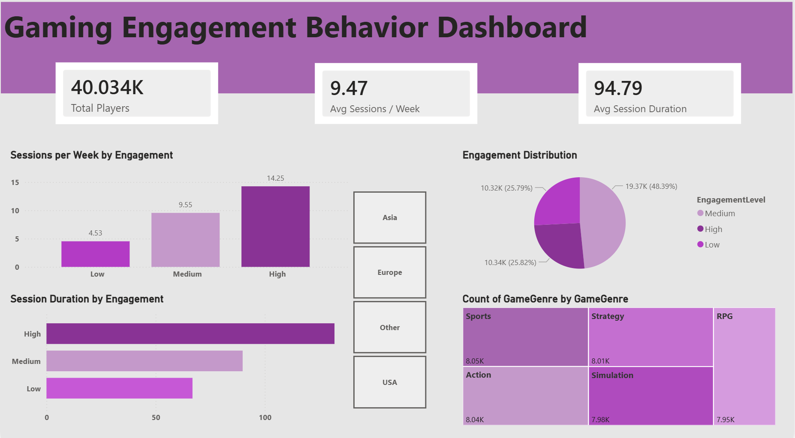

#  Gaming Engagement Behavior Analysis

---

## Project Overview
This project explores player engagement behavior in online gaming using data analysis, machine learning, and dashboard visualization.

---

##  Dashboard Link
[View Interactive Dashboard](https://app.powerbi.com/view?r=eyJrIjoiMzQwYjI5ZmUtNDc2Yi00ODk5LThlNzQtMzJjZGY4YWQ3YWQ4IiwidCI6ImI0NTNkOTFiLTZhYzEtNGI2MS1iOGI4LTVlNjVlNDIyMjMzZiIsImMiOjl9)

---

##  Tools & Technologies
- Python (Pandas, NumPy, Scikit-learn, Matplotlib, Seaborn)
- Machine Learning (Random Forest Classifier)
- Data Visualization (Power BI, Matplotlib, Seaborn)
- Jupyter Notebook

---

##  Objectives
- Analyze player behavior patterns
- Identify factors affecting engagement
- Build a predictive model for engagement level

---

##  Key Insights
- Player engagement increases with session frequency and session duration
- Game genre has minimal impact on engagement
- In-game purchases are not a strong predictor of engagement

---

##  Machine Learning Model
- Model: Random Forest Classifier
- Accuracy: ~91%

---

##  Dashboard
A Power BI dashboard was created to visualize key insights and player behavior patterns.

---

## 📁 Files Included
- `online_gaming_engagement_prediction.ipynb` → Data analysis & modeling
- `Gaming_Engagement_Dashboard.pbix` → Power BI dashboard
- `cleaned_gaming_data.csv` → Dataset used
